# **Jarkom-Modul-4-C11-2022**

*Repository* ini berisi laporan resmi dari praktikum modul 4 dari mata kuliah Jaringan Komputer tahun 2022.

 

## **Data Diri**
| Nama | Kelas-Kelompok | NRP |
| ------------- | ------------- | ------------- |
| Nur Muhammad Ainul Yaqin | C-11 | 5025201011 |

 

## **Persiapan Topologi**

Topologi yang digunakan adalah sebagai berikut. 

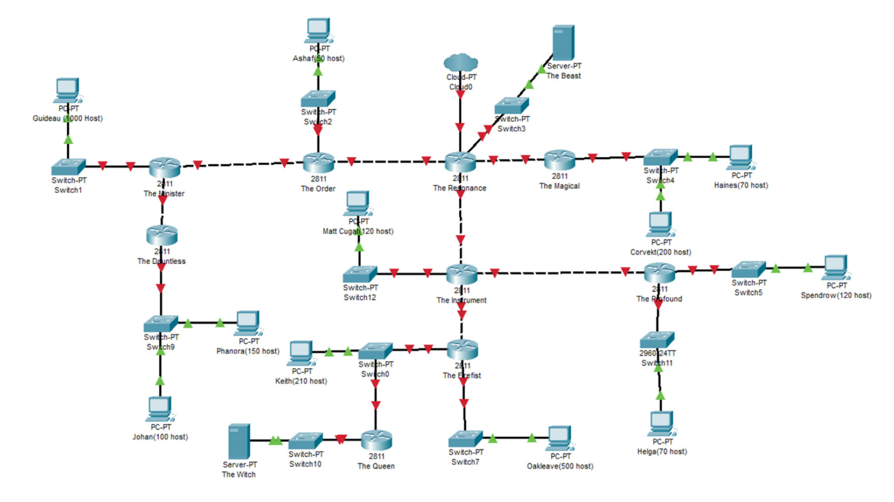

Perhitungan alokasi IP Address dilakukan dengan dua cara, yaitu VLSM dan CIDR.

### **Perhitungan VLSM**

Perhitungan VLSM digunakan untuk topologi pada Cisco Packet Tracer. Perhitungan dilakukan dengan beberapa tahapan sebagai berikut. 

1. **Analisis**

    Analisis dilakukan berdasarkan topologi yang telah disusun. Berdasarkan topologi tersebut, dibuat beberapa daerah subnet. Setiap subnet didefinisikan jumlah IP host yang ditanganinya serta nilai netmask yang mewakili sebagai berikut.

    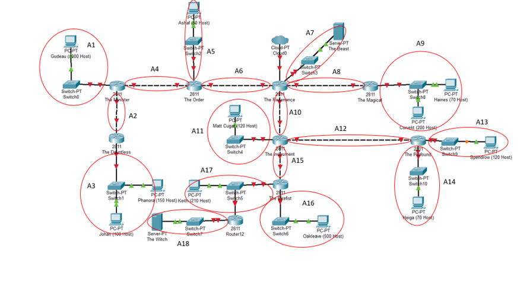

   | **Subnet (Alias)** | **Jumlah IP Host** | **Netmask** |
   | ---- | ------- | ------- |
   | A1 | 1001 | /22 |
   | A2 | 2 | /30 |
   | A3 | 251 | /24 |
   | A4 | 2 | /30 |
   | A5 | 51 | /26 |
   | A6 | 2 | /30 |
   | A7 | 2 | /30 |
   | A8 | 2 | /30 |
   | A9 | 271 | /23 |
   | A10 | 2 | /30 |
   | A11 | 121 | /23 |
   | A12 | 2 | /30 |
   | A13 | 121 | /25 |
   | A14 | 71 | /25 |
   | A15 | 2 | /30 |
   | A16 | 501 | /23 |
   | A17 | 212 | /24 |
   | A18 | 2 | /30 |
   | **Total Host** | **2618** | **/20** |

    Berdasarkan total IP host dan netmask yang dibutuhkan, root subnet yang dibentuk memiliki NID 10.15.0.0 dengan netmask /20. 

2. **Alokasi**

    Alokasi IP Address dilakukan berdasarkan analisis yang telah dilakukan dengan hasil dalam tabel sebagai berikut.

   | **Subnet (Alias)** | NID | Available Hosts | Broadcast Address | Netmask |
   | ------- | ------- | ------- | ------- | ------- |
   | A1 | 10.15.4.0 | 10.15.4.1 - 10.15.7.254 | 10.15.7.255 | 255.255.252.0 |
   | A2 | 10.15.11.192 | 10.15.11.193 - 10.15.11.194 | 10.15.11.195 | 255.255.255.252 |
   | A3 | 10.15.8.0 | 10.15.8.1 - 10.15.8.254 | 10.15.8.255 | 255.255.255.0 |
   | A4 | 10.15.11.196 | 10.15.11.197 - 10.15.11.198 | 10.15.11.199 | 255.255.255.252 |
   | A5 | 10.15.11.128 | 10.15.11.129 - 10.15.11.190 | 10.15.11.191 | 255.255.255.192 |
   | A6 | 10.15.11.200 | 10.15.11.201 - 10.15.11.202 | 10.15.11.203 | 255.255.255.252 |
   | A7 | 10.15.11.204 | 10.15.11.205 - 10.15.11.206 | 10.15.11.207 | 255.255.255.252 |
   | A8 | 10.15.11.208 | 10.15.11.209 - 10.15.11.210 | 10.15.11.211 | 255.255.255.252 |
   | A9 | 10.15.0.0 | 10.15.0.1 - 10.15.1.254 | 10.15.1.255 | 255.255.254.0 |
   | A10 | 10.15.11.212 | 10.15.11.213 - 10.15.11.214 | 10.15.11.215 | 255.255.255.252 |
   | A11 | 10.15.10.0 | 10.15.10.1 - 10.15.10.126 | 10.15.10.127 | 255.255.255.128 |
   | A12 | 10.15.11.216 | 10.15.11.217 - 10.15.11.218 | 10.15.11.219 | 255.255.255.252 |
   | A13 | 10.15.10.128 | 10.15.10.129 - 10.15.10.254 | 10.15.10.255 | 255.255.255.128 |
   | A14 | 10.15.11.0 | 10.15.11.1 - 10.15.11.127 | 10.15.11.127 | 255.255.255.128 |
   | A15 | 10.15.11.220 | 10.15.11.221 - 10.15.11.222 | 10.15.11.223 | 255.255.255.252 |
   | A16 | 10.15.2.0 | 10.15.2.1 - 10.15.3.254 | 10.15.3.255 | 255.255.254.0 |
   | A17 | 10.15.9.0 | 10.15.9.1 - 10.15.9.254 | 10.15.9.255 | 255.255.255.0 |
   | A18 | 10.15.11.224 | 10.15.11.225 - 10.15.11.226 | 10.15.11.227 | 255.255.255.252 |

3. **Pohon IP Address VLSM**
   Pohon IP Address VLSM dibuat dengan memerhatikan alokasi IP Address yang telah dilakukan sebagai berikut.

   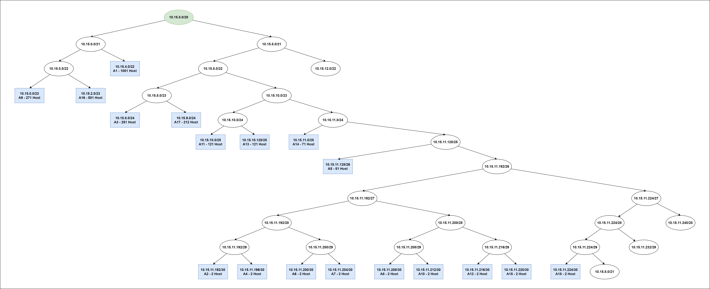

4. **Pemasangan IP Address**
   
   | **Node**           | **Interface** | **IP Address**               |
   | -------------- | --------- | ----------------- |
   | The Minister   | Fa0/0     | 10.15.11.198 |
   |                | Fa0/1     | 10.15.4.1 |
   |                | Fa1/0     | 10.15.11.193    |
   | The Dauntless  | Fa0/0     | 10.15.11.194 |
   |                | Fa0/1     | 10.15.8.1    |
   | The Order      | Fa0/0     | 10.15.11.202 |
   |                | Fa1/0     | 10.15.11.197  |
   |                | Fa0/1     | 10.15.11.129  |
   | The Resonance  | Fa0/0     | 10.15.11.201 |
   |                | Fa0/1     | 10.15.11.209 |
   |                | Eth1/1    | 10.15.11.213 |
   |                | Eth1/2    | 10.15.11.205 |
   | The Magical    | Fa0/0     | 10.15.11.210 |
   |                | Fa0/1     | 10.15.0.1  |
   | The Instrument | Fa0/0     | 10.15.10.1 |
   |                | Fa0/1     | 10.15.11.214 |
   |                | Fa1/0     | 10.15.11.221 |
   |                | Fa1/1     | 10.15.11.217  |
   | The Profound  | Fa0/0     | 10.15.11.218 |
   |                | Fa0/1     | 10.15.10.129   |
   |                | Fa1/0     | 10.15.11.1 |
   | The Firefist   | Fa0/0     | 10.15.11.222 |
   |                | Fa0/1     | 10.15.9.1    |
   |                | Fa1/0     | 10.15.2.1    |
   | The Queen      | Fa0/0     | 92.184.11.225   |
   |                | Fa0/1     | 10.15.9.2 |

    Untuk Client, IP Address menyesuaikan daerah subnet-nya dan available IP Address host-nya.

5. **Static Routing**

   | **Node**           | **Stating Routing**                     |
   | -------------- | ------------------------------------ |
   | The Minister   | 0.0.0.0/0 via 10.15.11.197        |
   |                | 10.15.8.0/24 via 10.15.11.194   |
   | The Dauntless  | 0.0.0.0/0 via 10.15.11.193    |
   | The Order      | 0.0.0.0/0 via 10.15.11.201    |
   |                | 10.15.4.0/22 via 10.15.11.198         |
   |                | 10.15.11.192/30 via 10.15.11.198        |
   |                | 10.15.8.0/24 via 10.15.11.198         |
   | The Resonance  | 10.15.0.0/23 via 10.15.11.210    |
   |                | 10.15.11.196/30 via 10.15.11.202 |
   |                | 10.15.11.192/30 via 10.15.11.202 |
   |                | 10.15.8.0/24 via 10.15.11.202   |
   |                | 10.15.11.128/26 via 10.15.11.202         |
   |                | 10.15.4.0/22 via 10.15.11.202 |
   |                | 10.15.10.0/25 via 10.15.11.214    |
   |                | 10.15.11.216/30 via 10.15.11.214  |
   |                | 10.15.10.128/25 via 10.15.11.214        |
   |                | 10.15.11.0/25 via 10.15.11.214 |
   |                | 10.15.11.220/30 via 10.15.11.214    |
   |                | 10.15.2.0/23 via 10.15.11.214   |
   |                | 10.15.9.0/24 via 10.15.11.214         |
   |                | 10.15.11.224/30 via 10.15.11.214         |
   | The Magical    | 0.0.0.0/0 via 10.15.11.209 |
   | The Instrument | 0.0.0.0/0 via 10.15.11.213         |
   |                | 10.15.10.128/25 via 10.15.11.218        |
   |                | 10.15.11.0/25 via 10.15.11.218         |
   |                | 10.15.2.0/23 via 10.15.11.222        |
   |                | 10.15.9.0/24 via 10.15.11.222         |
   |                | 10.15.11.224/30 via 10.15.11.222        |
   | The Profound  | 0.0.0.0/0 via 10.15.11.217         |
   | The Firefist   | 0.0.0.0/0 via 10.15.11.221        |
   |                | 10.15.11.224/30 via 10.15.9.2           |
   | The Queen      | 0.0.0.0/0 via 10.15.9.1           |

6. Percobaan
   
    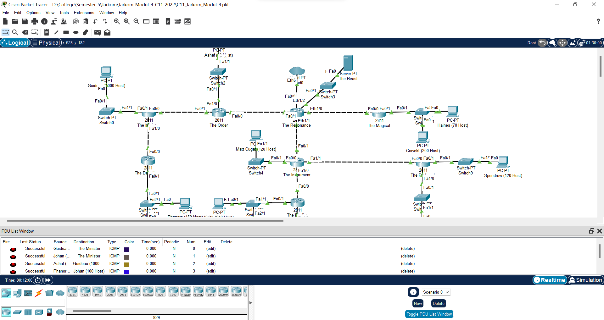

 

### **Perhitungan CIDR**

Perhitungan CIDR digunakan untuk topologi pada GNS3. Perhitungan dilakukan dengan beberapa tahapan sebagai berikut. 

1. **Analisis Jarak Subnet**

    Sesuai dengan pembagian daerah subnet pada VLSM, maka pada CIDR dilakukan penghitungan jarak antara suatu subnet dengan subnet yang berhubungan dengan cloud atau NAT.

    

   | **Subnet (Alias)** | **Jumlah IP Host** | **Netmask** | **Jarak dari Cloud** |
   | ------- | ------- | ------- | ------- |
   | A1 | 1001 | /22 | 3 |
   | A2 | 2 | /30 | 3 |
   | A3 | 251 | /24 | 4 |
   | A4 | 2 | /30 | 2 |
   | A5 | 51 | /26 | 2 |
   | A6 | 2 | /30 | 1 |
   | A7 | 2 | /30 | 1 |
   | A8 | 2 | /30 | 1 |
   | A9 | 271 | /23 | 2 |
   | A10 | 2 | /30 | 1 |
   | A11 | 121 | /23 | 2 |
   | A12 | 2 | /30 | 2 |
   | A13 | 121 | /25 | 3 |
   | A14 | 71 | /25 | 3 |
   | A15 | 2 | /30 | 2 |
   | A16 | 501 | /23 | 3 |
   | A17 | 212 | /24 | 3 |
   | A18 | 2 | /30 | 4 |
   

2. **Iterasi Merging Subnet**

    Perhitungan jarak pada poin sebelumnya digunakan sebagai acuan untuk membuat tree dari alokasi IP Address pada CIDR. Tree sendiri dapat dibuat dalam tabel merging subnet sebagai berikut.

    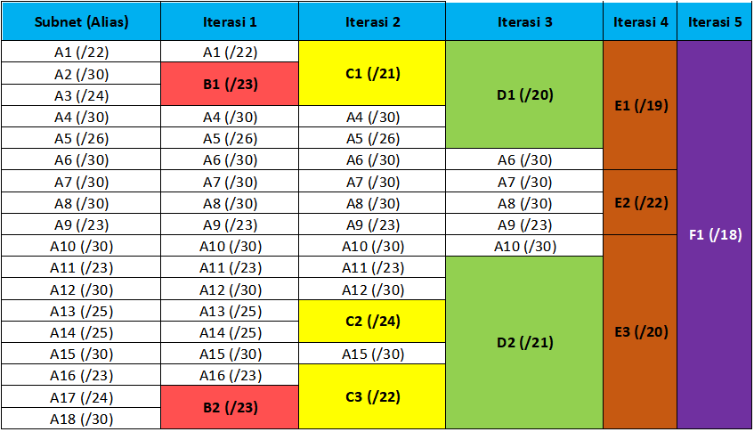

    Visualisasi iterasi adalah sebagai berikut.

    - Iterasi 0

        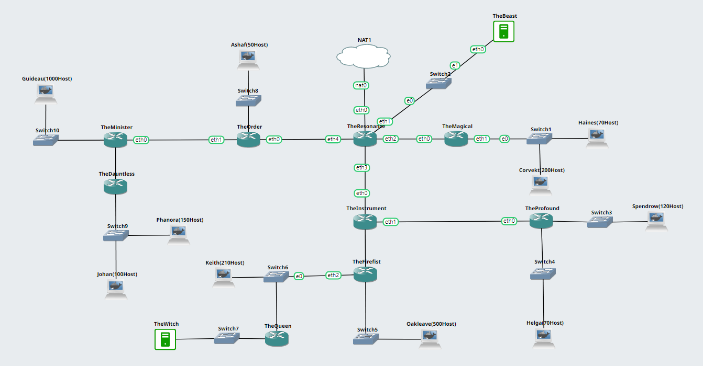

    - Iterasi 1

        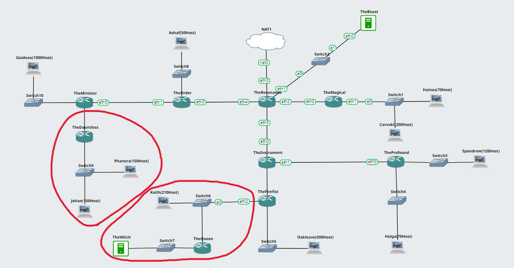

    - Iterasi 2
        
        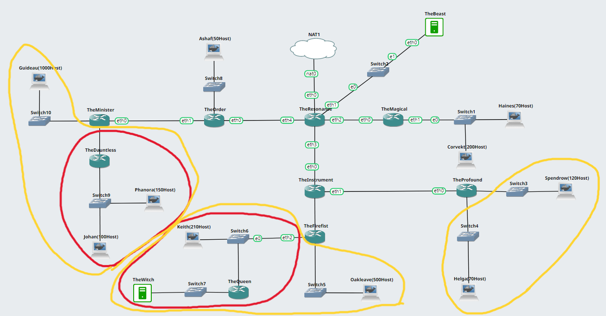

    - Iterasi 3

        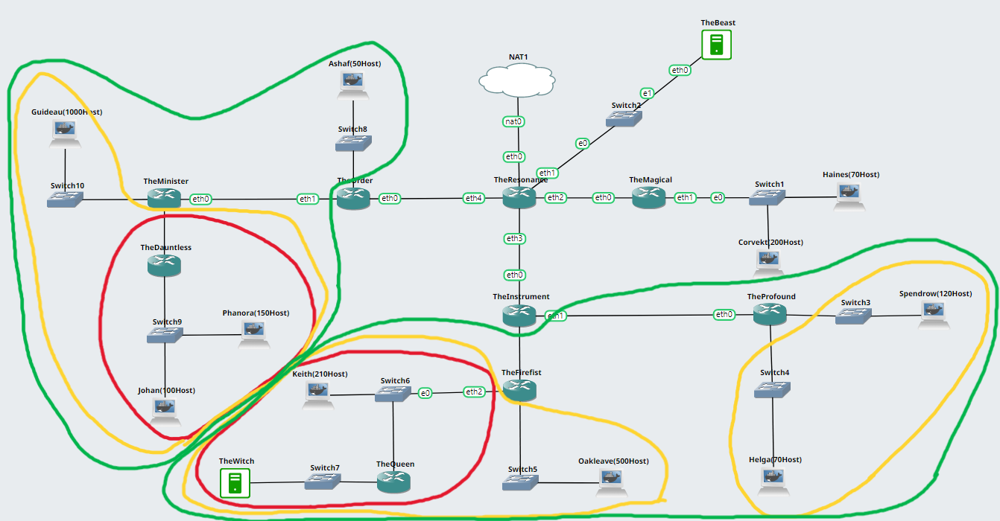

    - Iterasi 4

        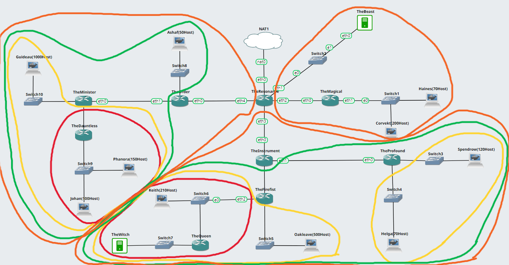

    - Iterasi 5

        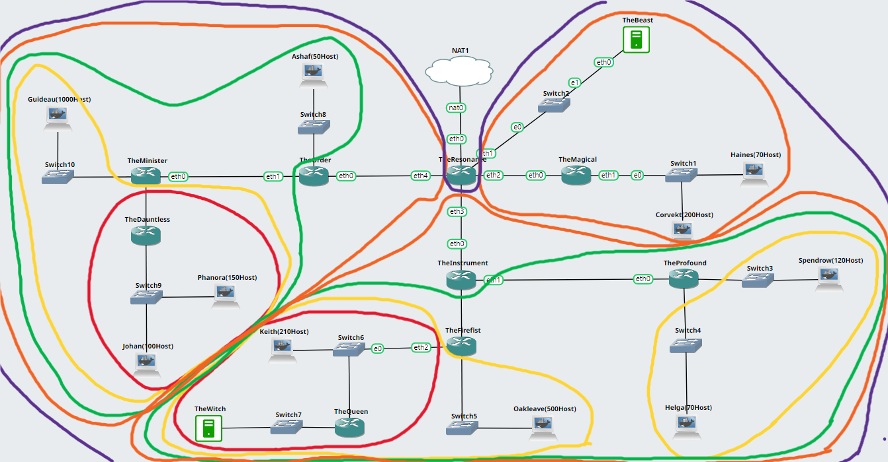

 

## **Kendala yang Dihadapi**
Terdapat beberapa kendala saat pengerjaan praktikum, antara lain sebagai berikut.

1. Tantangan dalam manajemen pekerjaan dan waktu, karena dikerjakan sendiri tanpa adanya pembagian task.
2. Final Gemastik dan PIMNAS, yang akhirnya membuat pekerjaan tidak tuntas pada CIDR.